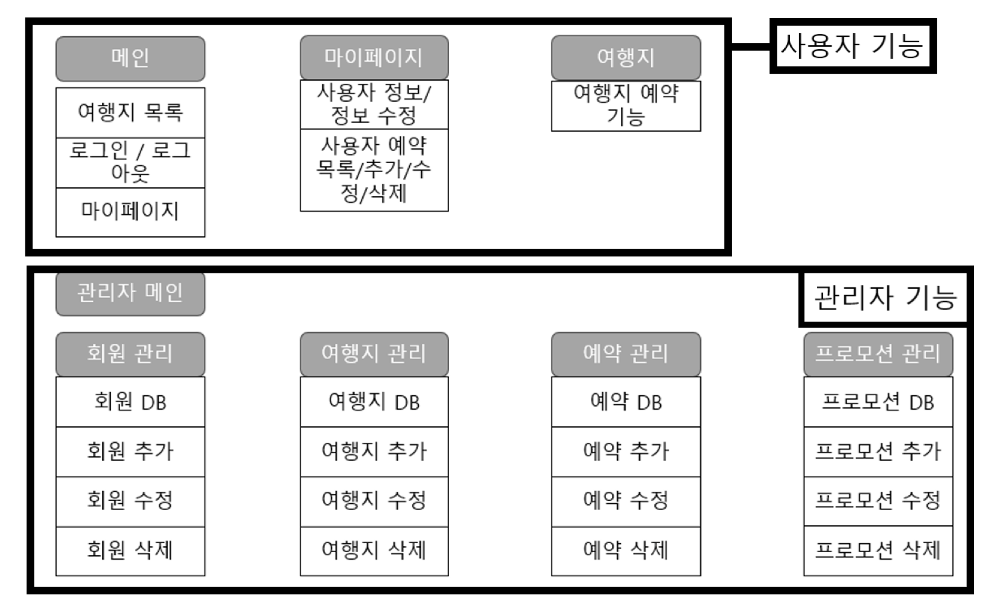

## 프로젝트 개요
2023년 기존의 [여행 사이트 홈페이지](https://smokypine.github.io/)를 JSP 형식을 이용해 업그레이드하였습니다.

## 활용 기술
```
JSP
html/css
Apache Tomcat(Server)
MySQL Workbench(Database)
```

## 코드 실행
```
WebContent/index.jsp(메인 페이지)

```

## 조직도
<br/>

## 메뉴별 권한
<br/>

## 사이트 기능
### 1. 메인 페이지
#### 1-1. 헤더
<br/>
- index 페이지와 Header 페이지를 따로 분리하여 구현함.
- 회원 가입 링크를 클릭하면 회원 가입 페이지로 이동함.<br/><br/>

<br/>
- 회원 가입 버튼을 클릭하면 입력한 데이터가 DB에 저장되고 index.jsp 페이지로 돌아감.
- 리셋 버튼을 클릭하면 textfield에 입력한 모든 내용이 리셋됨.<br/><br/><br/>

#### 1-2. index 페이지
<br/>
- <%@ include file="./header.jsp" %> 코드를 이용해 헤더 파일을 index 페이지에 불러옴.
- 위와 마찬가지 방법을 이용해 footer.jsp 파일을 index 페이지 최하단에 include 함.
- 로그인 시 로그아웃/마이페이지(root로 로그인시 관리자 페이지) 기능 지원.<br/><br/>

<br/>
- 로그인 한 상태에서 예약하기 버튼을 클릭시 해당 회원 명의로 DB에 예약정보가 추가됨.<br/><br/>

### 2. 마이 페이지/관리자 페이지
#### 2-1. 마이 페이지
<br/>
- 내 정보 보기/수정 과 내 예약 관리(보기/수정) 의 기능들을 지원함.
- 보안을 위해 각 기능을 실행하기 위해선 해당 회원의 2차 인증을 구현함.<br/><br/>

<br/>
- 내 예약 관리에선 해당 회원의 예약 열람/추가/수정/취소 와 같은 총 4가지 기능 지원.<br/><br/>

#### 2-2. 관리자 페이지
<br/>
- 내 예약 관리에선 해당 회원의 예약 열람/추가/수정/취소 와 같은 총 4가지 기능 지원.<br/><br/>

<br/>
- 내 예약 관리에선 해당 회원의 예약 열람/추가/수정/취소 와 같은 총 4가지 기능 지원.<br/><br/>

<br/>
- 내 예약 관리에선 해당 회원의 예약 열람/추가/수정/취소 와 같은 총 4가지 기능 지원.<br/><br/>

<br/>
- 내 예약 관리에선 해당 회원의 예약 열람/추가/수정/취소 와 같은 총 4가지 기능 지원.<br/><br/>


## 결론
- html을 이용하여 여행지 홈페이지를 구현
- css를 이용해 홈페이지 디자인 구성<br/>

## 향후 목표
1) 로그인/회원가입/마이페이지 기능 구현.
2) Database와의 연동을 통한 여행지 관리/예약 및 회원 관리 기능 구현.
3) Header/footer 파일을 분리하여 import 하는 것으로 코드 최적화.<br/>

## 참조 사이트
- [모두투어](https://www.modetour.com/)
- [하나투어](https://www.hanatour.com/)
- [참좋은여행](https://www.verygoodtour.com/Home/PackageMain)
