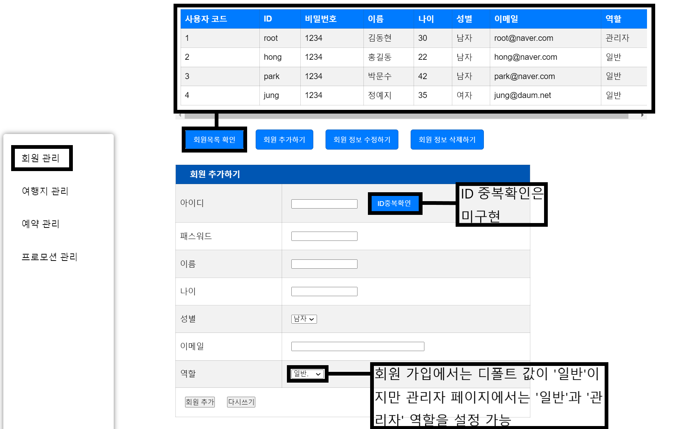

## 프로젝트 개요
2022년에 구현했던 [여행 사이트 홈페이지](https://smokypine.github.io/)를 JSP를 이용해 재구현했습니다.

## 활용 기술
```
JSP (Java Server Page)
Apache Tomcat (Server)
MySQL Workbench (Database)
```

## 코드 실행
```
WebContent/index.jsp(메인 페이지)
```

## 메뉴별 기능
<br/>

## 메뉴별 권한
<br/>

## 사이트 기능
### 1. 메인 페이지
#### 1-1. 헤더
<br/>
- Index 페이지와 header 페이지를 따로 분리하여 구현함.
- 회원 가입 링크를 클릭하면 회원 가입 페이지로 이동함.<br/><br/>

<br/>
- 회원 가입 버튼을 클릭하면 입력한 데이터가 DB에 저장되고 index.jsp 페이지로 돌아감.
- 리셋 버튼을 클릭하면 textfield에 입력한 모든 내용이 리셋됨.<br/><br/><br/>

#### 1-2. index 페이지
<br/>
- <%@ include file="./header.jsp" %> 코드를 이용해 헤더 파일을 index 페이지에 불러옴.
- 위와 마찬가지 방법을 이용해 footer.jsp 파일을 index 페이지 최하단에 include 함.
- 로그인 시 로그아웃/마이페이지(root로 로그인시 관리자 페이지) 기능 지원.<br/><br/>

<br/>
- 로그인 한 상태에서 예약하기 버튼을 클릭시 해당 회원 명의로 DB에 예약정보가 추가됨.<br/><br/>

### 2. 마이 페이지/관리자 페이지
#### 2-1. 마이 페이지
<br/>
- 내 정보 보기/수정 과 내 예약 관리(보기/수정) 의 기능들을 지원함.
- 보안을 위해 해당 회원의 2차 인증 기능을 구현함.<br/><br/>

<br/>
- 내 예약 관리에선 해당 회원의 예약 열람/추가/수정/취소 와 같은 총 4가지 기능 지원.<br/><br/>

#### 2-2. 관리자 페이지
<br/>
- 관리자 페이지는 회원 관리/여행지 관리/예약 관리/프로모션 관리 의 총 4가지 페이지로 구성되어 있음.<br/><br/>

<br/>
- 회원 관리 페이지에서는 회원 추가/수정/삭제 의 3가지 기능을 지원.
- 회원 관리 페이지에서는 default로 설정된 일반 이외에 '관리자' 역할을 설정할 수 있음.<br/><br/>

<br/>
- 여행지 관리 페이지에서는 여행지 추가/수정/삭제 의 3가지 기능을 지원
- 여행 방식의 default는 '패키지'지만 '자유' 여행 또한 설정 가능.<br/><br/>

<br/>
- 예약 관리 페이지에서는 예약 추가/수정/삭제 의 3가지 기능을 지원.
- 예약을 위해 필요한 사용자 코드/아이디, 여행지 코드, 프로모션 코드는 각각 회원목록/여행목록/프로모션 목록 버튼을 눌러 확인 가능.<br/><br/>

<br/>
- 프로모션 관리 페이지에서는 프로모션 추가/수정/삭제 의 3가지 기능을 지원.<br/><br/>

## 서블릿 구성
크게 5가지 목적을 가진 대분류로 나눔.
### 1. 회원가입/로그인/로그아웃 기능
```
JoinController.java (회원가입)
LoginController.java (로그인)
LogoutController.java (로그아웃)
```

### 2. 관리자/마이페이지 회원 관리
```
MemberDAO.java (회원가입 및 관리를 위한 function 모음)
MemberDTO.java (MemberDAO.java에서 쓰는 데이터의 set/get)
MemberMyPageController.java (마이페이지에서 사용자의 정보를 출력/수정하는 기능)

MemberController.java (관리자 페이지의 회원 추가 기능)
MemberChangeController.java (관리자 페이지의 회원 수정 기능)
MemberDeleteController.java (관리자 페이지의 회원 삭제 기능)
```

### 3. 관리자 페이지 여행지 관리
```
DestinationDAO.java (여행지 관리를 위한 function 모음)
DestinationDTO.java (DestinationDAO.java에서 쓰는 데이터의 set/get)

DestinationController.java (관리자 페이지의 여행지 추가 기능)
DestinationChangeController.java (관리자 페이지의 여행지 수정 기능)
DestinationDeleteController.java (관리자 페이지의 여행지 삭제 기능)
```

### 4. 관리자 페이지 프로모션 관리
```
PromotionDAO.java (프로모션 관리를 위한 function 모음)
PromotionDTO.java (PromotionDAO.java에서 쓰는 데이터의 set/get)

PromotionController.java (관리자 페이지의 프로모션 추가 기능)
PromotionChangeController.java (관리자 페이지의 프로모션 수정 기능)
PromotionDeleteController.java (관리자 페이지의 프로모션 삭제 기능)
```

### 5. 관리자/마이페이지 예약 관리
```
ReservationDAO.java (예약을 위한 function 모음)
ReservationDTO.java (ReservationDAO.java에서 쓰는 데이터의 set/get)
ReservationMyPageController.java (마이페이지에서 사용자의 예약 정보를 출력하는 기능)

ReservationController.java (관리자 페이지의 예약 추가 기능)
ReservationChangeController.java (관리자 페이지의 예약 수정 기능)
ReservationDeleteController.java (관리자 페이지의 예약 삭제 기능)
```

## 결론
- html로 구현된 정적 웹페이지를 apache tomcat과 JSP를 이용하여 동적 웹페이지로 재구현.
- Database를 조합하여 데이터의 삽입/수정/삭제 와 로그인/회원가입 기능 구현.<br/><br/>

## 향후 목표
1) UI/UX를 고려하여 디자인 개선.
2) header.jsp에 구현한 여행지 메뉴 및 하위 메뉴를 DB에서 출력되는 방식으로 수정.
3) 하드코딩된 여행지 정보 테이블의 정보 및 이미지를 DB에서 출력되는 방식으로 수정.
4) 로그인 실패 시 발생하는 이벤트 JSP를 구현.
5) 관리자 페이지의 DB select(검색) 기능 구현.
<br/>

## 참조 사이트
- [모두투어](https://www.modetour.com/)
- [하나투어](https://www.hanatour.com/)
- [참좋은여행](https://www.verygoodtour.com/Home/PackageMain)
